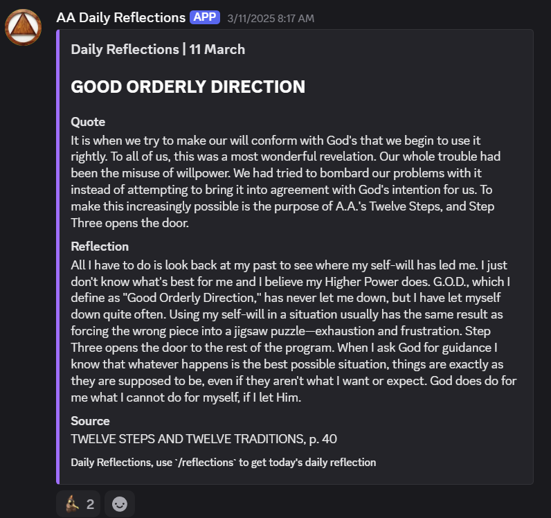

# AA Daily Reflections discord bot

The **AA Daily Reflections** project is a serverless application designed to post daily reflections from the Alcoholics Anonymous (AA) book [Daily Reflections](https://www.aa.org/daily-reflections-0) into Discord. This bot operates in two modes: **invoked** and **scheduled**. In invoked mode, users can trigger the bot using the `/reflections` command in Discord, while in scheduled mode, the bot automatically posts reflections at specified intervals using Cron jobs on Netlify.

## Who is This Document For?

This document is designed for:

1. Developers who are:

   - Familiar with web development in TypeScript and Next.js.
   - Experienced with cloud deployment platform Netlify.
   - Interested in building Discord app integrations.

2. Recruiters looking to evaluate:

   - Technical skills and abilities of a backend developer.

### Technical Prerequisites

Ensure you have:

- Familiarity with JavaScript and TypeScript development for Node.js runtime.
- General web-development skills, including familarity with REST APIs.
- Familiarity with PostgreSQL and using Supabase for database operations.
- Experience with continuous integration and deployment process through GitHub and Netlify.
- Both Discord and GitHub accounts.
- Working knowledge of task scheduling with Cron jobs.

### Key Terms

- **Serverless Architecture**: A cloud computing execution model where the cloud provider dynamically allocates machine resources.
- **Netlify Functions**: An example of serverless architecture, [Netlify Functions](https://docs.netlify.com/functions/overview/) allow developers to run server-side code without managing a server.
- **Supabase**: An open-source platform that provides a PostgreSQL database with a RESTful API.
- **Discord**: A chat and community building platform.
- **Discord embeds**: A single message in Discord that allows structured integration of links, images, videos, and other content. Learn more about [Discord Embeds](https://discord.com/safety/using-webhooks-and-embeds#title-4).
- **Discord Webhooks**: RESTful API URLs for one-way event triggers (e.g. sending messages in Discord, user logged-in, etc). Learn more [about webhooks](https://discord.com/developers/docs/events/webhook-events).
- **Cron**: Unix tool for scheduling repetitive tasks at fixed intervals.

## Key Features

- **Discord Integration**: The bot interacts with users through Discord, fetching and displaying the AA Daily Reflections.
- **Serverless Architecture**: Uses [Netlify Functions](https://docs.netlify.com/functions/overview/) as an API for lower-level functions. Scales as needed and integrates with CI/CD pipeline through GitHub.
- **Database Management**: Utilizes Supabase (PostgreSQL) for storing the text of the AA Daily Reflections, ensuring type-safe database operations with auto-generated TypeScript types served through a PostgREST API.
- **Modular Design**: The codebase is organized into distinct modules, promoting maintainability and ease of debugging.

## Technology Stack

- **[Node.js](https://nodejs.org)**: JavaScript runtime.
- **[Discord.js](https://discord.js.org/)**: For creating and managing Discord bot interactions and embeds.
- **[Netlify](https://www.netlify.com/)**: For continuous integration and deployment, event-driven [function activation](https://docs.netlify.com/functions/get-started/?fn-language=ts#synchronous-function), as well as scheduling tasks [via Cron](https://docs.netlify.com/functions/scheduled-functions/).
- **[Supabase](https://supabase.com/)**: For database storage and management, providing a PostgreSQL backend with real-time capabilities accessible through a REST API.
- **[TypeScript](https://www.typescriptlang.org/)**: Ensures type safety and enhances code reliability throughout the application.

## Architectural Decisions

1. **Serverless Architecture**: Deployment on Netlify gives access to [AWS lambda functions](https://docs.aws.amazon.com/lambda/latest/dg/concepts-basics.html#gettingstarted-concepts-function) for event-driven code execution, but version controlled and bundled with the rest of the application on GitHub. This app architecture pairs well with nonpersistent connections across microservices, e.g. webhook-driven Discord interactions for the AA Daily Reflections bot.

2. **Supabase as Database**: Supabase was chosen for its PostgreSQL compatibility and PostgREST API for developer usability. The use of generated types in TypeScript ensures type-safe database operations.

3. **TypeScript Implementation**: Full adoption of TypeScript enhances code reliability, improves maintainability, and provides static type checking, which is crucial for catching errors early in the development process.

4. **Modular Code Structure**: The clear separation between functions and utilities improves code organization, testability, and maintainability, allowing for reusable components.

5. **Centralized Error Handling**: A dedicated error handling module ensures consistent error management, making debugging easier and providing standardized error responses.

## Getting Started

This project runs in Node.js and uses [`pnpm`](https://pnpm.io/) as its package manager. You are welcome to use npm or yarn if you prefer. (or Bun or ...) Install the [LTS version of Node](https://nodejs.org/en/download) if you do not have it.

WARNING: commands referencing `pnpm` can be substituted with `npm` (e.g. `pnpm install` becomes `npm install`) but yarn or other package managers will require different commands to activate scripts.

`package.json` specifies the depencies of the project as well as shorthand scripts for running TypeScript files, running the dev server locally, and generating types for the project from Supabase.

### External Services

This project leverages several external services that require individual setup and secret saving.

### Secrets Setup

Create a `.env` file in the root directory. You will save credentials from each of the following services:

#### Discord

##### Discord Bot

Here's a guide to [creating a Discord bot](https://discordjs.guide/preparations/setting-up-a-bot-application.html#creating-your-bot). Save your secrets as part of your setup.

      1. DISCORD_BOT_TOKEN = ''
      2. DISCORD_PUBLIC_KEY = ''
      3. DISCORD_CLIENT_ID = ''

##### Discord Server

When activated, the bot will send a formatted message to the list of webhooks `DISCORD_WEBHOOK_URL_1`, `DISCORD_WEBHOOK_URL_2`, etc. from the `.env` file. These URLs post messages to their corresponding Discord server.

I have a [demonstration Discord server](#see-output-in-discord) running that displays messages received via Webhook 1.

You must have a valid Discord webhook URL to output to the corresponding Discord server. [Create your own webhook](https://support.discord.com/hc/en-us/articles/228383668-Intro-to-Webhooks) for your server and save the URL as webhook 2.

    1. DISCORD_WEBHOOK_URL_1 = 'https://discord.com/api/webhooks/1359294999816179984/40Nc_KfXUDRlUNg3gbt4p6Ir6na2E8Onq2sYdSbIMIeQNr93Ej6Sd927Ba3wIDoPwxqf'
    2. DISCORD_WEBHOOK_URL_2 = ''

#### Supabase

Here is the [Supabase PostgREST API URL](https://supabase.com/docs/guides/api) for read access to the project.

    1. SUPABASE_URL = 'https://hqkqajujwqdmzebklwqo.supabase.co'

### Running the Repository

To run this project locally, follow these steps:

1. **Clone the Repository**:

   ```bash
   git clone https://github.com/yourusername/demo-aa-daily-reflections.git
   cd demo-aa-daily-reflections
   ```

2. **Install Dependencies**:

   Dependencies are specified in `package.json`.

   ```bash
   npm install
   # or
   pnpm install
   # or
   yarn install
   ```

3. **Set Up Environment Variables**:
   Your `.env` file should have all of the following secrets:

   ```
   DISCORD_BOT_TOKEN = ''
   DISCORD_PUBLIC_KEY = ''
   DISCORD_CLIENT_ID = ''
   DISCORD_WEBHOOK_URL_1 = 'https://discord.com/api/webhooks/1359294999816179984/40Nc_KfXUDRlUNg3gbt4p6Ir6na2E8Onq2sYdSbIMIeQNr93Ej6Sd927Ba3wIDoPwxqf'
   DISCORD_WEBHOOK_URL_2 = ''
   SUPABASE_URL = 'https://hqkqajujwqdmzebklwqo.supabase.co'
   ```

   Follow the [steps above](#secrets-setup) if you do not yet have values for all the secrets.

   The `DISCORD_BOT_TOKEN` is the password for your bot. Never commit secrets to git history or any public virtual compute server.

4. **Run the Application**:

   Use the following command to start the development server:

   ```bash
   pnpm netlify dev
   # or
   npm netlify dev
   ```

5. **Create your Discord Bot**

   Follow [these directions to create your own Discord bot](https://discordjs.guide/preparations/setting-up-a-bot-application.html#creating-your-bot) to handle user interactions in **invoked mode**.

6. **Invite the bot to a Server**

   Use your [bot invite link](https://discordjs.guide/preparations/adding-your-bot-to-servers.html#creating-and-using-your-invite-link) to add the bot to your Discord server.

7. **Activate the Bot**: Either of these will output the Daily Reflections to your Discord server.

   a. **Scheduled mode:** While the dev server is live, [Netlify Functions provide simulated scheduled activation](https://docs.netlify.com/cli/manage-functions/#invoke-functions-while-running-netlify-dev) by using the command:

   ```bash
   pnpm netlify functions:invoke reflection
   # or
   npm netlify functions:invoke reflection
   ```

   b. **Invoked mode:** In the Discord server with the bot, use the command `/reflections` to fetch and post today's AA Daily Reflection.

   =========================

   I have a demo Discord server that [you may join](https://discord.gg/scExqC4yzB) as a temporary member to use `/reflections` in without setting up your own server.



### Deploy through Netlify (optional)

If you want to deploy a live version of the project, follow Netlify's guide for [deploying a project from GitHub](https://docs.netlify.com/welcome/add-new-site/#import-from-an-existing-repository).

Get the site URL from your project settings after deployment and add it to your `.env` secrets.

      1. NETLIFY_APP_URL = ''

## Testing Locally

The project includes a suite of unit tests located in the `/tests` directory. These tests cover various aspects of the application, including database operations and Discord interactions. To run a test file, use the following command:

```bash
pnpm ts PATH/FILENAME.ts
```

To do integration testing, run the dev server `pnpm netlify dev` and then activate the API function by using the command `pnpm netlify functions:invoke reflection`.

### See Output in Discord

I have a demo Discord server that [you may join](https://discord.gg/scExqC4yzB) as a temporary member to use `/reflections` in without setting up your own server.

This is the server that receives the output from the [`DISCORD_WEBHOOK_URL_1` above](#discord-server). You must [create your own webhook](https://support.discord.com/hc/en-us/articles/228383668-Intro-to-Webhooks) and save it as `DISCORD_WEBHOOK_URL_2` in your `.env` to output to your server.

---
---

_Thank you to [@patrickmabbott](https://github.com/patrickmabbott) and [@mmalvarez](https://github.com/mmalvarez) for help and feedback on this document._
